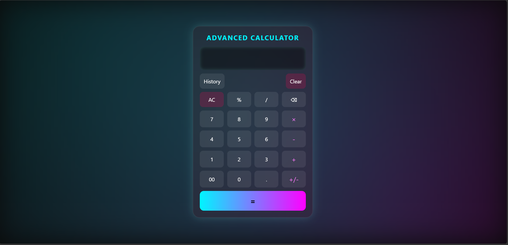

# 🚀 Advanced Calculator

A modern, responsive, and feature-rich **Advanced Calculator** built using **HTML, CSS, and JavaScript**. This project goes beyond basic arithmetic by offering calculation history, keyboard support, percentage calculations, sign toggling, and Persistent calculation history using Browser Local Storage.

---

## ✨ Features

### 🧮 Calculator Operations
- Addition (+)
- Subtraction (-)
- Multiplication (×)
- Division (÷)
- Decimal calculations (.)
- Percentage calculations (%)
- Double zero (00) input
- Positive/Negative (+/-) toggle
- Backspace 

### 📚 Calculation History
- Save calculation history automatically
- View previous calculations
- Clear entire history
- Persistent storage using Local Storage
- History remains available after page refresh

### ⌨️ Keyboard Support
| Key | Function |
| 0-9 | Number Input |
| + - * % / | Operators |
| . | Decimal Point |
| Enter or = | Calculate Result |
| Backspace | Delete Last Character |
| Escape | Clear Display |

### 🎨 User Interface
- Modern responsive design
- Smooth hover animations
- Mobile-friendly layout
- Clean and intuitive user experience
- Interactive buttons and display area

### ⚡ Additional Functionalities
- All Clear (AC)
- Backspace/Delete
- Error handling for invalid expressions
- Real-time display updates
- Persistent calculation history

---

## 🛠️ Technologies Used

- HTML5
- CSS3
- JavaScript (ES6)
- Browser Local Storage
- DOM Manipulation
- Event Handling

---

## 🚀 How It Works

### Input Handling
Users can enter values using:
- Calculator buttons
- Keyboard shortcuts

### Calculation Process
1. User enters an expression.
2. Input is validated.
3. Expression is evaluated.
4. Result is displayed.
5. Calculation is saved to history.
6. History is stored in Local Storage.

### History Management
The calculator automatically:
- Stores completed calculations
- Displays history on demand
- Saves history in browser Local Storage
- Restores history after page reload

---

## 📱 Responsive Design

The calculator is optimized for:

✅ Desktop
✅ Laptop
✅ Tablet
✅ Mobile Devices

Media queries ensure smooth performance and usability across different screen sizes.

---

## 🧠 Concepts Practiced

This project helped strengthen understanding of:

- DOM Manipulation
- Event Handling
- Local Storage
- JavaScript Functions
- Arrays
- Error Handling
- Responsive Web Design
- User Interface Design
- Browser APIs

---

## 🎯 Future Enhancements

Potential upgrades include:

- Scientific Calculator Functions
  - sin()
  - cos()
  - tan()
  - log()
  - square root

- Dark/Light Theme Toggle
- Copy Result Button
- Export History
- Memory Functions (M+, M-, MR)
- Voice Input Support
- Advanced Mathematical Operations

---

## 📖 Installation

# How to Run
1. Download or clone the repository.
2. Open `index.html` in any modern web browser.
3. Start performing calculations.

## 💡 Learning Outcomes

Through this project, I gained practical experience in:

- Building interactive web applications
- Managing browser storage
- Implementing responsive layouts
- Handling user interactions efficiently
- Creating reusable JavaScript functions
- Improving UI/UX design skills

---

## 👩‍💻 Author

**Gauri Gupta**
Aspiring Full Stack Developer passionate about web development, problem-solving, and continuously learning modern technologies.

---

## ⭐ Support
If you found this project useful, consider giving it a ⭐ on GitHub and sharing your feedback.

---

### 🚀 Code • Learn • Build • Improve

## Preview 

## Github Repo Link🔗
https://github.com/gauri9368gupta-maker/Codebasestudio-project

## Live Link🔗
https://gauri9368gupta-maker.github.io/Codebasestudio-Project/Task1-Advance-Calculator/
